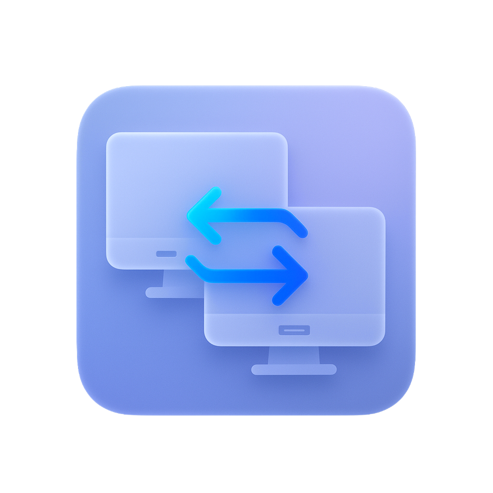

  

# 显示器输入源切换器 (Display Input Switcher)

这是一个基于C# 开发的桌面应用程序，允许用户通过VESA DDC/CI协议控制显示器的输入源切换。

## 主要功能

- **自动识别显示器**：自动识别所有连接的、支持DDC/CI的显示器
- **显示器信息展示**：显示名称、分辨率、当前输入源等信息
- **输入源切换**：支持DP、HDMI1、HDMI2等多种输入源切换
- **简洁界面**：符合Windows 11设计风格的简洁界面

## 系统要求

- Windows 10/11操作系统
- .NET 8.0运行时（[下载链接](https://dotnet.microsoft.com/download/dotnet/8.0)）
- 管理员权限（与显示器通信需要）

## 使用方法

1. 确保已经安装.NET 8.0运行时
2. 以管理员身份运行应用程序
3. 程序会自动检测所有支持DDC/CI的显示器
4. 从下拉菜单选择目标输入源
5. 点击"应用"按钮切换输入源

## 输入源代码说明

程序中预设的输入源代码如下：
- 15 = DisplayPort
- 17 = HDMI1
- 18 = HDMI2

由于不同显示器可能使用不同的代码，如有问题请咨询显示器厂商。

## 常见问题

- **显示器不被检测或无法切换**：请确认显示器支持DDC/CI协议，并已在显示器OSD菜单中开启
- **需要管理员权限**：与显示器硬件通信需要管理员权限
- **切换失败**：可能是显示器不支持指定的输入源或使用了不同的输入源代码

## 开发相关

本程序使用C# (.NET 8)和WPF框架开发，通过P/Invoke调用Windows API与显示器进行通信。 